# VibeScribe

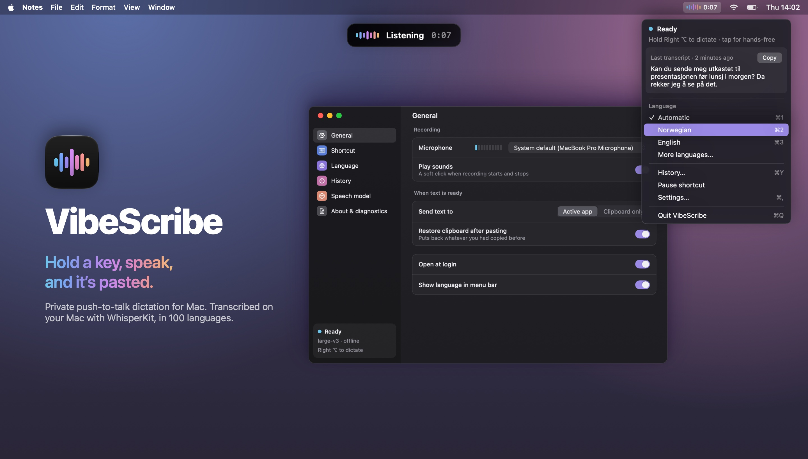

A menu bar app for push-to-talk dictation on Mac. Hold a key, speak, and let go: VibeScribe types what you said wherever your cursor is. Speech is transcribed on your Mac with [WhisperKit](https://github.com/argmaxinc/argmax-oss-swift), in 100 languages. No account, API key or cloud service is involved.

## Install

You need macOS 14 or later on an Apple Silicon Mac, and the Swift 6.2 toolchain (included with Xcode 26, or install the [command line tools](https://www.swift.org/install/macos/)).

1. Clone and build the app:

   ```bash
   git clone https://github.com/flatoy/vibescribe.git
   cd vibescribe
   bash package_app.sh
   ```

2. Move `VibeScribe.app` to your Applications folder and open it.
3. Follow the setup window. It asks for three permissions and downloads the speech model (about 630 MB) while you grant them:
   - **Microphone**, to hear you
   - **Input Monitoring**, so the shortcut works in every app
   - **Accessibility**, to paste for you. Without it, transcripts are copied and you press ⌘V yourself.

   When System Settings opens, a small card follows it. Drag VibeScribe from the card into the list, or turn its switch on if it’s already there. The card closes once the permission is allowed.

   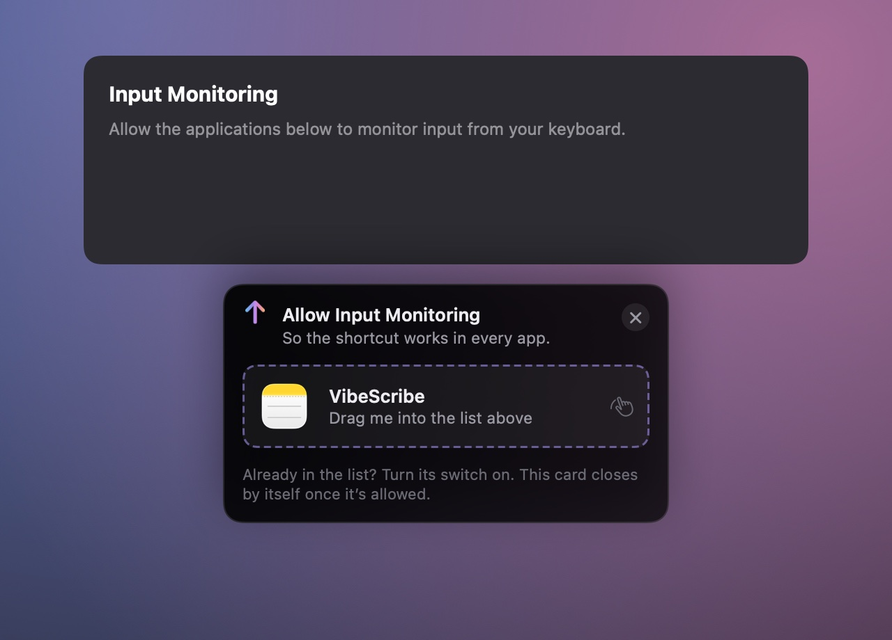

4. Try it in the practice box, then hold **Right ⌥** in any app and speak.

The build is ad-hoc signed for your own Mac. After you rebuild or update, macOS may switch Accessibility off again; the menu bar icon gets an orange dot and the menu offers a one-click fix.

## How it works

### The overlay

A small pill below the menu bar shows what’s happening. The waveform follows your voice while you speak, shimmers while the model works, and confirms how it ended: pasted, copied, or nothing heard. Press **esc** to throw a recording away. Holding the key in silence pastes nothing, instead of the “Thank you.” Whisper tends to invent.

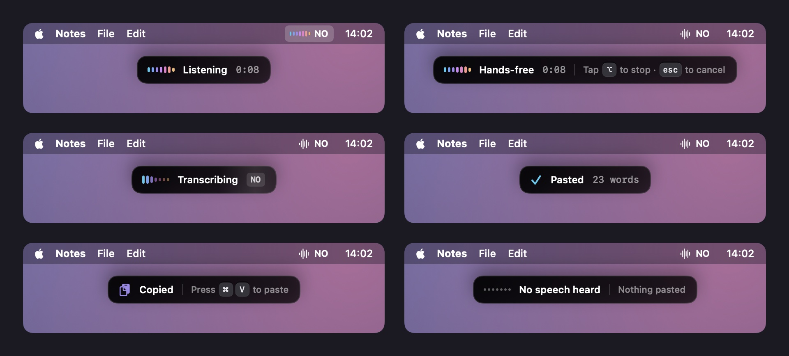

- **Hold** the shortcut to talk, and let go to paste.
- **Tap** it to go hands-free, and tap again to stop.
- Prefer one or the other? Choose **Hold only** or **Tap only** in Settings.

### First launch

The model download starts on the first screen and continues while you grant permissions, so you rarely wait on a progress bar. You can pause it, and if your connection drops it resumes on its own.

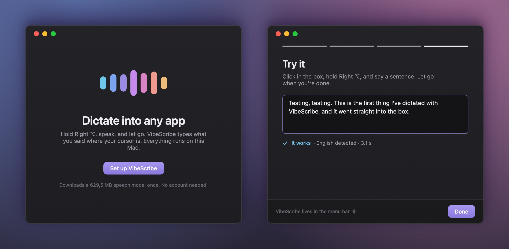

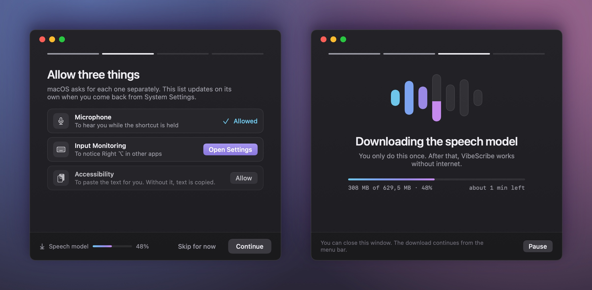

### Languages

Press **⌥⇧** anywhere to search the 100 languages by English or native name. Pin up to three favourites for **⌘1–⌘3**; the languages you used recently sit just below them. **Automatic** detects the language for you.

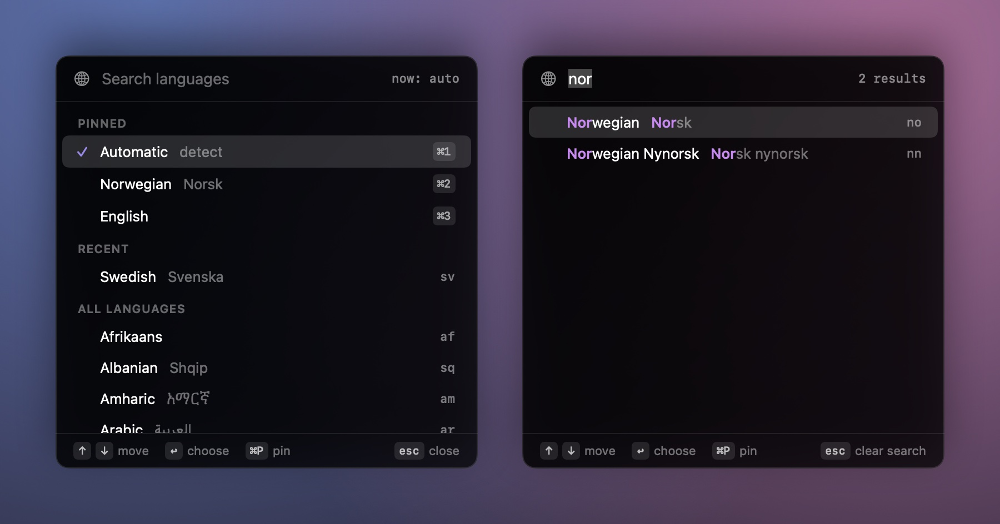

### The menu bar

The icon shows what VibeScribe is doing: ready, recording (the only time it turns colourful), transcribing, downloading, or needing attention. The menu has your last transcript, your pinned languages, and a switch to pause the shortcut during games or screen sharing.

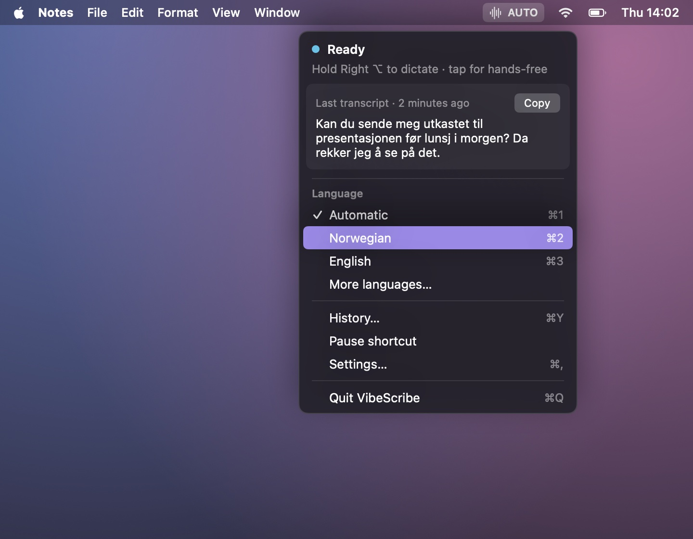

### Settings

Pick a microphone and watch its input level, choose whether text is pasted or only copied, record any shortcut, and add a vocabulary of names and jargon so the model spells them your way.

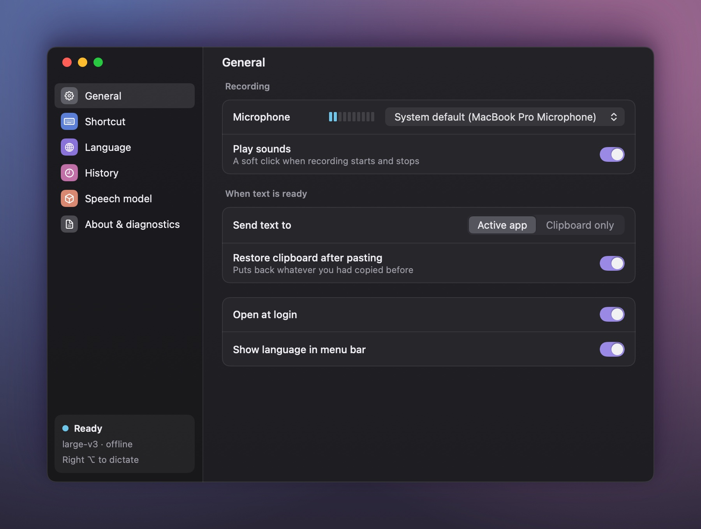

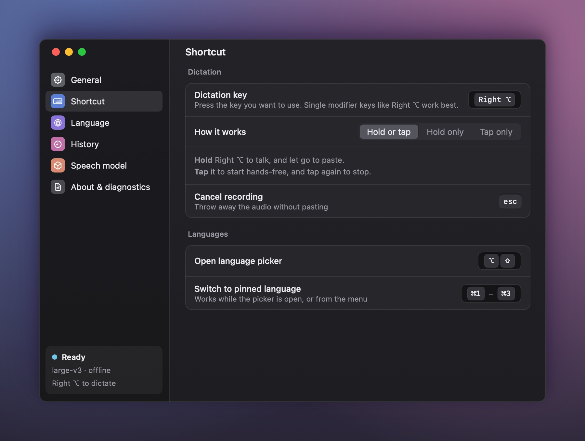

**History** keeps your transcripts on this Mac for as long as you choose, from not at all to forever, so text that went into the wrong window is never lost. Search it, copy an entry, or paste it again.

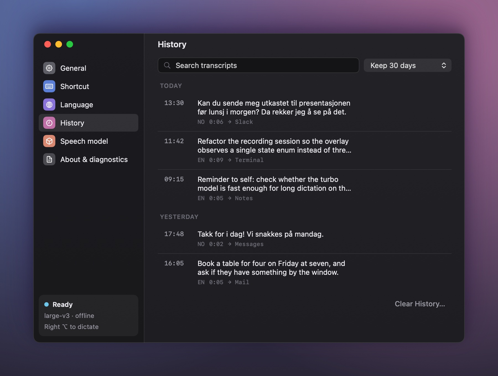

**Speech model** shows what’s installed. Switch to **large-v3 turbo** for roughly 3× faster transcription, at a small cost in accuracy for less common languages. It downloads in the background while dictation keeps working.

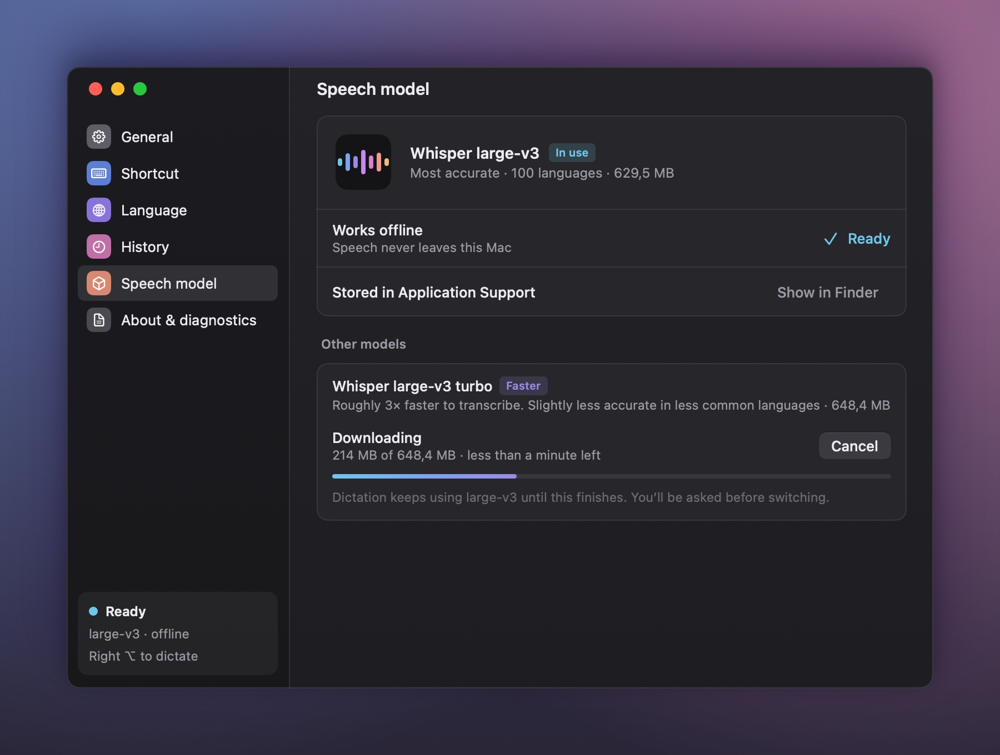

## Privacy

- Audio is processed in memory on your Mac and never saved or sent anywhere.
- The only network traffic is the one-time model download from Hugging Face. Every file is pinned to a revision and verified by SHA-256.
- History is stored in `~/Library/Application Support/io.m10s.vibescribe/History.json` and can be turned off or cleared at any time.

## Develop

Run from source with the same first-launch flow:

```bash
swift run VibeScribe
```

To prefetch the model into the ignored build cache for development or offline smoke tests, run `python3 scripts/download_whisper_model.py`.

Build and run the tests. They use a small executable harness, so Xcode isn’t required:

```bash
swift build
swift run VibeScribeTests
```

The README images are rendered from the app’s real SwiftUI views with sample data:

```bash
swift run VibeScribeScreenshots assets
```

### Where things live

| Part | Code |
|---|---|
| App wiring and recording flow | `Sources/VibeScribeCore/VibeScribeApp.swift` |
| Overlay | `Sources/VibeScribeCore/UI/OverlayView.swift` |
| Setup window | `Sources/VibeScribeCore/UI/OnboardingView.swift` |
| Settings window | `Sources/VibeScribeCore/UI/SettingsView.swift`, `SettingsPages.swift` |
| Language picker | `Sources/VibeScribeCore/UI/LanguagePickerView.swift` |
| Menu bar | `Sources/VibeScribeCore/MenuBarController.swift` |
| Colours and components | `Sources/VibeScribeCore/UI/Theme.swift`, `Spectrum.swift`, `Controls.swift` |
| Shortcuts and hold/tap logic | `HotkeyListener.swift`, `HotkeyCoordinator.swift` |
| Pinned model downloads | `scripts/whisper_model_manifest.json`, `scripts/whisper_model_manifest_turbo.json` |

### Packaging

`package_app.sh` builds a small `VibeScribe.app` without model weights. To customize the bundle ID or version, edit `version.env`. The script supports the `ARCHES`, `SIGNING_MODE` and `APP_IDENTITY` build settings; distribution to other Macs needs Developer ID signing and notarization.

The editable app icon is `Icon.icon`. After changing it in Icon Composer, export the macOS Default image at 1024 pt and 1× to `Icon.png`; the packaging script converts that image to `Icon.icns`.

## Contributing

Issues and pull requests are welcome. Keep changes focused and run `swift run VibeScribeTests` before submitting.

## License

VibeScribe is MIT licensed; see `LICENSE`. Licenses and notices for WhisperKit and the downloaded speech models are in `Sources/VibeScribe/Resources/Licenses`.
